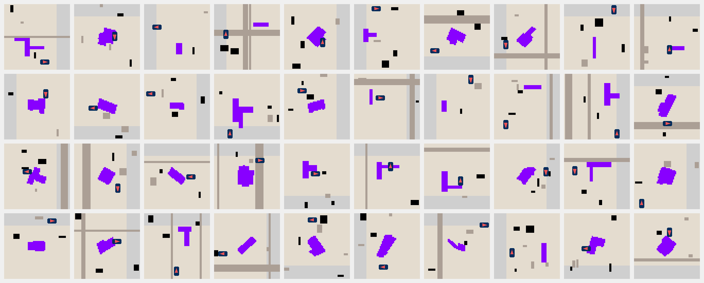

# 🌍🚀 Terra Baselines - Training, Evals, and Checkpoints for Terra
Terra Baselines provides a set of tools to train and evaluate RL policies on the [Terra](https://github.com/leggedrobotics/Terra) environment. This implementation allows to train an agent capable of planning earthworks in trenches and foundations environments in less than 1 minute on 8 Nvidia RTX-4090 GPUs.

## Features
- Train on multiple devices using PPO with `train.py` (based on [XLand-MiniGrid](https://github.com/corl-team/xland-minigrid))
- Generate metrics for your checkpoint with `eval.py`
- Visualize rollouts of your checkpoint with `visualize.py`
- Run a grid search on the hyperparameters with `train_sweep.py` (orchestrated with [wandb](https://wandb.ai/))

## Installation
Clone the repo and install the requirements with
```
pip install -r requirements.txt
```

Clone [Terra](https://github.com/leggedrobotics/Terra) in a different folder and install it with
```
pip install -e .
```

Lastly, [install JAX](https://jax.readthedocs.io/en/latest/installation.html).

## Train
Setup your training job configuring the `TrainConfig`
``` python
@dataclass
class TrainConfig:
    name: str
    num_devices: int = 0
    project: str = "excavator"
    group: str = "default"
    num_envs_per_device: int = 4096
    num_steps: int = 32
    update_epochs: int = 3
    num_minibatches: int = 32
    total_timesteps: int = 3_000_000_000
    lr: float = 3e-4
    clip_eps: float = 0.5
    gamma: float = 0.995
    gae_lambda: float = 0.95
    ent_coef: float = 0.01
    vf_coef: float = 5.0
    max_grad_norm: float = 0.5
    eval_episodes: int = 100
    seed: int = 42
    log_train_interval: int = 1
    log_eval_interval: int = 50
    checkpoint_interval: int = 50
    clip_action_maps = True
    local_map_normalization_bounds = [-16, 16]
    loaded_max = 100
    num_rollouts_eval = 300
```
Then, setup the curriculum in `config.py` in Terra (making sure the maps are saved to disk).

Run a training job with
```
DATASET_PATH=/path/to/dataset DATASET_SIZE=<num_maps_per_type> python train.py -d <num_devices>
```
and collect your weights in the `checkpoints/` folder.

## Sweep

You can run a hyperparameter sweep over reward settings using [Weights & Biases Sweeps](https://docs.wandb.ai/guides/sweeps). This allows you to efficiently grid search or random search over reward parameters and compare results.

### 1. Define the Sweep

The sweep configuration is defined in `sweep.py`. It includes a grid over reward parameters such as `existence`, `collision_move`, `move`, etc. The sweep uses the `TrainConfigSweep` dataclass, which extends the standard training config with sweepable reward parameters.

### 2. Create the Sweep

To create a new sweep on wandb, run:
```bash
python sweep.py create
```
This will print a sweep ID (e.g., `abc123xy`). Copy this ID for the next step.

### 3. Launch Agents

You can launch multiple agents (workers) to run experiments in parallel. Each agent will pick up a different configuration from the sweep and start a training run.

To launch an agent, run:
```bash
wandb agent <SWEEP_ID>
```
You can run this command multiple times (e.g., in different terminals, or as background jobs in a cluster script) to parallelize the sweep.

#### Example: Running Multiple Agents in a Cluster Script

If you are using a cluster, you can use the provided `sweep_cluster.sh` script. Make sure to set the `SWEEP_ID` variable to your sweep ID:
```bash
# In sweep_cluster.sh
SWEEP_ID=<YOUR_SWEEP_ID>
wandb agent $SWEEP_ID &
wandb agent $SWEEP_ID &
wandb agent $SWEEP_ID &
wandb agent $SWEEP_ID &
wait
```

## Eval
Evaluate your checkpoint with standard metrics using
```
DATASET_PATH=/path/to/dataset DATASET_SIZE=<num_maps_per_type> python eval.py -run <checkpoint_path> -n <num_environments> -steps <num_steps>
```

## Visualize
Visualize the rollout of your policy with
```
DATASET_PATH=/path/to/dataset DATASET_SIZE=<num_maps_per_type> python visualize.py -run <checkpoint_path> -nx <num_environments_x> -ny <num_environments_y> -steps <num_steps> -o <output_path.gif>
```

## Plan Extraction and Analysis

Extract and analyze terrain modification plans from your trained policies using the plan extraction tools.

### Extract Plans
Extract action maps and terrain modifications from policy rollouts:
```bash
python extract_plan.py -policy <checkpoint_path> -map <map_metadata_path> -steps <max_steps> -o <output_plan.pkl>
```

Example:
```bash
python extract_plan.py -policy checkpoints/tracked-dense.pkl -map plan_maps/foundation -o plan.pkl
```

This captures the robot state and terrain modifications at each DO (dig/dump) action, storing:
- Agent position, orientation, and loaded state
- Terrain change values and modification masks
- Traversability information

### Visualize Plans
Create visualizations of the extracted terrain modification plans:
```bash
python visualize_plan.py <plan.pkl>
```

This generates multi-panel plots showing:
- Terrain modification masks (where digging/dumping occurred)
- Traversability maps with agent positions
- Terrain change values and action map evolution
- Combined overlays of all modifications

## Baselines
We train 2 models capable of solving both foundation and trench type of environments. They differentiate themselves based on the type of agent (wheeled or tracked), and the type of curriculum used to train them (dense reward with single level, or sparse reward with curriculum). All models are trained on 64x64 maps and are stored in the `checkpoints/` folder.

| Checkpoint           | Map Type  | $C_r$ | $S_p$ | $S_w$ | $Coverage$ |
|----------------------|-----------|-------|-------|-------|------------|
| `tracked-dense.pkl`  |Foundations|97%|5.66 (1.51)|19.06 (2.86)|0.99 (0.04)|
|                      |Trenches   |94%|7.09 (5.66)|20.57 (5.26)|0.99 (0.10)|
| `wheeled-dense.pkl`  |Foundations|99%|11.43 (8.96)|22.06 (3.65)|1.00 (0.00)|
|                      |Trenches   |89%|15.84 (25.10)|21.12 (5.65)|0.96 (0.14)|

Where we define the metrics from [Terenzi et al](https://arxiv.org/abs/2308.11478):

$$
\begin{equation}
    \text{Completion Rate}= C_{r} = \frac{N_{terminated}}{N_{total}}
\end{equation}
$$

$$
\begin{equation}
    \text{Path Efficiency}=S_{p}=\sum_{i=0}^{N-1} \frac{\left(x_{B_{i+1}}-x_{B_{i}}\right)}{\sqrt{A_{d}}}    
\end{equation}
$$

$$
\begin{equation}
    \text{Workspace Efficiency} = S_{w} = \frac{N_{w} \cdot A_{w}}{A_{d}}    
\end{equation}
$$

$$
\begin{equation}
    \text{Coverage}=\frac{N_{tiles\ dug}}{N_{tiles\ to\ dig}}    
\end{equation}
$$

### Model Details
All the models we train share the same structure. We encode the maps with a CNN, and the agent state and local maps with MLPs. The latent features are concatenated and shared by the two MLP heads of the model (value and action). In total, the model has ~130k parameters counting both value and action weights.

## Policy Rollouts 😄
Here's a collection of rollouts for the models we trained.
####  `tracked-dense.pkl`

#### `wheeled-dense.pkl`

