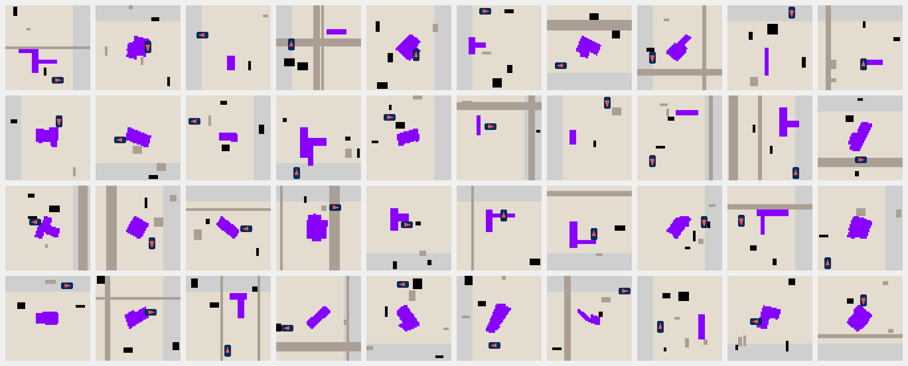

# 🌍🚀 Terra Baselines - Training, Evals, and Checkpoints for Terra
Terra Baselines provides a set of tools to train and evaluate RL policies on the [Terra](https://github.com/leggedrobotics/Terra) environment. This implementation allows to train an agent capable of planning earthworks in trenches and foundations environments in less than 1 minute on 8 Nvidia RTX-4090 GPUs.

## Features
- Train on multiple devices using PPO with `train.py` (based on [XLand-MiniGrid](https://github.com/corl-team/xland-minigrid))
- Generate metrics for your checkpoint with `eval.py`
- Visualize rollouts of your checkpoint with `visualize.py`
- Run a grid search on the hyperparameters with `train_sweep.py` (orchestrated with [wandb](https://wandb.ai/))

## Installation
Clone the repo and install the requirements with
```
pip install -r requirements.txt
```

Clone [Terra](https://github.com/leggedrobotics/Terra) in a different folder and install it with
```
pip install -e .
```

Lastly, [install JAX](https://jax.readthedocs.io/en/latest/installation.html).

## Train
Setup your training job configuring the `TrainConfig`
``` python
@dataclass
class TrainConfig:
    name: str
    num_devices: int = 0
    project: str = "excavator"
    group: str = "default"
    num_envs_per_device: int = 4096
    num_steps: int = 32
    update_epochs: int = 3
    num_minibatches: int = 32
    total_timesteps: int = 3_000_000_000
    lr: float = 3e-4
    clip_eps: float = 0.5
    gamma: float = 0.995
    gae_lambda: float = 0.95
    ent_coef: float = 0.01
    vf_coef: float = 5.0
    max_grad_norm: float = 0.5
    eval_episodes: int = 100
    seed: int = 42
    log_train_interval: int = 1
    log_eval_interval: int = 50
    checkpoint_interval: int = 50
    clip_action_maps = True
    local_map_normalization_bounds = [-16, 16]
    loaded_max = 100
    num_rollouts_eval = 300
```
Then, setup the curriculum in `config.py` in Terra (making sure the maps are saved to disk).

Run a training job with
```
DATASET_PATH=/path/to/dataset DATASET_SIZE=<num_maps_per_type> python train.py -d <num_devices>
```
and collect your weights in the `checkpoints/` folder.

## Training Configs (Recommended)

Instead of manually configuring agent types and maps, you can use **named presets** defined in `configs/training_configs.yaml`. This is the recommended approach for reproducible training setups.

### Quick Start with Configs

```bash
# List all available presets
python configs/training_configs.py

# Train with a specific preset
python train_mixed.py --config solo_excavator
python train_mixed.py --config excavator_skidsteer
python train_mixed.py --config excavator_truck
```

### Available Presets

| Config Name | Agents | Maps | Description |
|-------------|--------|------|-------------|
| `solo_excavator` | Excavator | `foundations` | Single excavator, no dumpzones |
| `solo_excavator_dumpzone` | Excavator | `foundations_dumpzones_v3` | Single excavator with dumpzones |
| `solo_skidsteer` | Skidsteer | `relocations_harder` | Single skidsteer relocation |
| `excavator_skidsteer` | Excavator + Skidsteer | `foundations_dumpzones_v3` | Two-agent foundation |
| `excavator_truck` | Excavator + Truck | `foundations_dumpzones_v3` | Truck without road restriction |
| `excavator_truck_roads` | Excavator + Truck | `foundations_dumpzones_roads` | Truck with road restriction |
| `dual_excavator` | 2 Excavators | `foundations_dumpzones_v3` | Two excavators working together |
| `excavators_truck` | 2 Excavators + Truck | `foundations_dumpzones_roads` | Three-agent with road restriction |
| `trench_excavator` | Excavator | `trenches/single` | Trench digging |
| `trench_dual` | Excavator + Skidsteer | `trenches/single_dumpzone_v2` | Trench with transport |
| `wheeled_solo_excavator` | Excavator (wheeled) | `foundations` | Wheeled movement |

### Config File Structure

Each preset in `configs/training_configs.yaml` defines:
- `agent_types`: Which agents to use (0=excavator, 1=truck, 2=skidsteer)
- `action_types`: Movement type (0=tracked, 1=wheeled)
- `reward_multipliers`: Reward shaping parameters
- `maps`: Which map datasets to train on

Example:
```yaml
excavator_skidsteer:
  description: Excavator + Skidsteer combination
  agent_types: [0, 2]
  action_types: [0, 0]
  reward_multipliers:
    dump_bonus_mult: 0.5
    excavator_relocate_dumped_mult: 0.2
  maps:
    - path: foundations_dumpzones_v3
      max_steps: 800
```

### CLI Overrides

You can override preset values with CLI arguments:
```bash
# Use preset but change a reward multiplier
python train_mixed.py --config excavator_truck --transport_relocate_mult 2.0

# Use preset but override agent types
python train_mixed.py --config solo_excavator --agent_types "(0,2)"
```


## Sweep

You can run a hyperparameter sweep over reward settings using [Weights & Biases Sweeps](https://docs.wandb.ai/guides/sweeps). This allows you to efficiently grid search or random search over reward parameters and compare results.

### 1. Define the Sweep

The sweep configuration is defined in `sweep.py`. It includes a grid over reward parameters such as `existence`, `collision_move`, `move`, etc. The sweep uses the `TrainConfigSweep` dataclass, which extends the standard training config with sweepable reward parameters.

### 2. Create the Sweep

To create a new sweep on wandb, run:
```bash
python sweep.py create
```
This will print a sweep ID (e.g., `abc123xy`). Copy this ID for the next step.

### 3. Launch Agents

You can launch multiple agents (workers) to run experiments in parallel. Each agent will pick up a different configuration from the sweep and start a training run.

To launch an agent, run:
```bash
wandb agent <SWEEP_ID>
```
You can run this command multiple times (e.g., in different terminals, or as background jobs in a cluster script) to parallelize the sweep.

#### Example: Running Multiple Agents in a Cluster Script

If you are using a cluster, you can use the provided `sweep_cluster.sh` script. Make sure to set the `SWEEP_ID` variable to your sweep ID:
```bash
# In sweep_cluster.sh
SWEEP_ID=<YOUR_SWEEP_ID>
wandb agent $SWEEP_ID &
wandb agent $SWEEP_ID &
wandb agent $SWEEP_ID &
wandb agent $SWEEP_ID &
wait
```

## Eval
Evaluate your checkpoint with standard metrics using
```
DATASET_PATH=/path/to/dataset DATASET_SIZE=<num_maps_per_type> python eval.py -run <checkpoint_path> -n <num_environments> -steps <num_steps>
```

## Visualize
Visualize the rollout of your policy with
```
DATASET_PATH=/path/to/dataset DATASET_SIZE=<num_maps_per_type> python visualize.py -run <checkpoint_path> -nx <num_environments_x> -ny <num_environments_y> -steps <num_steps> -o <output_path.gif>
```

## Baselines
We train 2 models capable of solving both foundation and trench type of environments. They differentiate themselves based on the type of agent (wheeled or tracked), and the type of curriculum used to train them (dense reward with single level, or sparse reward with curriculum). All models are trained on 64x64 maps and are stored in the `checkpoints/` folder.

| Checkpoint           | Map Type  | $C_r$ | $S_p$ | $S_w$ | $Coverage$ |
|----------------------|-----------|-------|-------|-------|------------|
| `tracked-dense.pkl`  |Foundations|97%|5.66 (1.51)|19.06 (2.86)|0.99 (0.04)|
|                      |Trenches   |94%|7.09 (5.66)|20.57 (5.26)|0.99 (0.10)|
| `wheeled-dense.pkl`  |Foundations|99%|11.43 (8.96)|22.06 (3.65)|1.00 (0.00)|
|                      |Trenches   |89%|15.84 (25.10)|21.12 (5.65)|0.96 (0.14)|

Where we define the metrics from [Terenzi et al](https://arxiv.org/abs/2308.11478):

$$
\begin{equation}
    \text{Completion Rate}= C_{r} = \frac{N_{terminated}}{N_{total}}
\end{equation}
$$

$$
\begin{equation}
    \text{Path Efficiency}=S_{p}=\sum_{i=0}^{N-1} \frac{\left(x_{B_{i+1}}-x_{B_{i}}\right)}{\sqrt{A_{d}}}    
\end{equation}
$$

$$
\begin{equation}
    \text{Workspace Efficiency} = S_{w} = \frac{N_{w} \cdot A_{w}}{A_{d}}    
\end{equation}
$$

$$
\begin{equation}
    \text{Coverage}=\frac{N_{tiles\ dug}}{N_{tiles\ to\ dig}}    
\end{equation}
$$

### Model Details
All the models we train share the same structure. We encode the maps with a CNN, and the agent state and local maps with MLPs. The latent features are concatenated and shared by the two MLP heads of the model (value and action). In total, the model has ~130k parameters counting both value and action weights.

## Policy Rollouts 😄
Here's a collection of rollouts for the models we trained.
####  `tracked-dense.pkl`

#### `wheeled-dense.pkl`


## 🏗️ Terra Environment Setup Catalog

This document is a **manual catalog** of all experimental setups used in the paper, including maps, agents, and configurations.

---

### Summary of Experimental Setups

This table provides a high-level overview of the environment setups. Click the links for the detailed setup configuration.

| Setup Name | Category | Map Family | Agents Type | Action Type | Details Link |
| :--- | :--- | :--- | :--- | :--- | :--- |
| **Single Agent Relocation (Excavator)** | relocation | `relocations_harder` | `0` (excavator) | `0` (tracked) | [Setup 1.1](#11-relocations-harder--single-agent---excavator) |
| **Single Agent Relocation (Skidsteer)** | relocation | `relocations_harder` | `2` (skidsteer) | `0` (tracked) | [Setup 1.2](#12-relocations-harder--single-agent---skidsteer) |
| **Single Agent Foundation** | foundation | `foundations` | `0` (excavator) | `0` (tracked) | [Setup 2.1](#21-foundation--single-agent) |
| **Excavator and Skidsteer** | foundation with dumpzones | `foundations_dumpzones_v3` | `0,2` | `0,0` | [Setup 3.1](#31-foundations-dumpzone---multi-agent---excavator-and-skidsteer) |
| **Excavator and Truck No Roads** | foundation with dumpzones | `foundations_dumpzones_v3` | `0,1` | `0,0` | [Setup 3.2-A](#32-foundations-dumpzone---multi-agent---excavator-and-truck-no-roads) |
| **Excavator and Truck Roads** | foundation with dumpzones | `foundations_dumpzones_roads` | `0,1` | `0,0` | [Setup 3.2-B](#32-foundations-dumpzone---multi-agent---excavator-and-truck-roads) |
| **Excavators and Truck Roads** | foundation with dumpzones | `foundations_dumpzones_roads` | `0,0,1` | `0,0,0` | [Setup 4.1](#4-foundation-maps-dumpzone---triple-agent) |

---

### 1. Relocation Maps

#### 1.1 Relocations (Harder) – Single Agent - Excavator

| Parameter | Value | Notes |
| :--- | :--- | :--- |
| **Setup name** | Single Agent Relocation | |
| **Category** | relocation | |
| **Map family** | `relocations_harder` | |
| **Agents Type** | `0` (**excavator**) | |
| **Action Type** | `0` (tracked) | |
| **Git commit (terra)** | [`c2d063a8`](https://github.com/leggedrobotics/terra/commit/c2d063a8223958c8c7a378eaf9e40f056db23dc6) | |
| **Git commit (terra-baselines)** | [`8d5ebbde`](https://github.com/leggedrobotics/terra-baselines/commit/8d5ebbdeedc45885096109f83ff08a463185ce0a) | |
| **Training script** | `terra-baselines/train_mixed.py` | Command: `--agent_types "(0,)" --action_types "(0,)"` |
| **Eval script** | `terra-baselines/eval_mixed.py` | |
| **Map generation path** | `terra/terra/env_generation/generate_relocations_harder.py` | |
| **Distance map path** | `terra/tools/generate_distance_maps.py` | |

#### 1.2 Relocations (Harder) – Single Agent - Skidsteer

| Parameter | Value | Notes |
| :--- | :--- | :--- |
| **Setup name** | Single Agent Relocation | |
| **Config name** | `solo_skidsteer` | Use: `--config solo_skidsteer` |
| **Category** | relocation | |
| **Map family** | `relocations_harder` | |
| **Agents Type** | `2` (**skidsteer**) | |
| **Action Type** | `0` (tracked) | |
| **Git commit (terra)** | [`c2d063a8`](https://github.com/leggedrobotics/terra/commit/c2d063a8223958c8c7a378eaf9e40f056db23dc6) | |
| **Git commit (terra-baselines)** | [`8d5ebbde`](https://github.com/leggedrobotics/terra-baselines/commit/8d5ebbdeedc45885096109f83ff08a463185ce0a) | |
| **Training script** | `terra-baselines/train_mixed.py` | Command: `--config solo_skidsteer` |
| **Eval script** | `terra-baselines/eval_mixed.py` | |
| **Map generation path** | `terra/terra/env_generation/generate_relocations_harder.py` | |
| **Distance map path** | `terra/tools/generate_distance_maps.py` | |

---

### 2. Foundation Maps (Normal)

#### 2.1 Foundation – Single Agent

| Parameter | Value | Notes |
| :--- | :--- | :--- |
| **Setup name** | Single Agent Foundation | |
| **Config name** | `solo_excavator` | Use: `--config solo_excavator` |
| **Category** | foundation | |
| **Map family** | `foundations` | |
| **Agents Type** | `0` (**excavator**) | |
| **Action Type** | `0` (tracked) | |
| **Git commit (terra)** | [`c2d063a8`](https://github.com/leggedrobotics/terra/commit/c2d063a8223958c8c7a378eaf9e40f056db23dc6) | |
| **Git commit (terra-baselines)** | [`8d5ebbde`](https://github.com/leggedrobotics/terra-baselines/commit/8d5ebbdeedc45885096109f83ff08a463185ce0a) | |
| **Training script** | `terra-baselines/train_mixed.py` | Command: `--config solo_excavator` |
| **Eval script** | `terra-baselines/eval_mixed.py` | |
| **Map generation path** | `terra/terra/env_generation/generate_dataset.py` | |
| **Distance map path** | `terra/tools/generate_distance_maps.py` | |

---

### 3. Foundation Maps (Dumpzone) - Multi Agent

#### 3.1 Foundations (Dumpzone) - Multi Agent - Excavator and Skidsteer

| Parameter | Value | Notes |
| :--- | :--- | :--- |
| **Setup name** | Excavator and Skidsteer | |
| **Config name** | `excavator_skidsteer` | Use: `--config excavator_skidsteer` |
| **Category** | foundation with dumpzones | |
| **Map family** | `foundations_dumpzones_v3` | |
| **Agents Type** | `0,2` (**excavator, skidsteer**) | |
| **Action Type** | `0,0` (tracked, tracked) | |
| **Git commit (terra)** | [`c2d063a8`](https://github.com/leggedrobotics/terra/commit/c2d063a8223958c8c7a378eaf9e40f056db23dc6) | |
| **Git commit (terra-baselines)** | [`8d5ebbde`](https://github.com/leggedrobotics/terra-baselines/commit/8d5ebbdeedc45885096109f83ff08a463185ce0a) | |
| **Training script** | `terra-baselines/train_mixed.py` | Command: `--config excavator_skidsteer` |
| **Eval script** | `terra-baselines/eval_mixed.py` | |
| **Map generation path** | `terra/terra/env_generation/generate_foundations_dumpzones_v3.py` | |
| **Distance map path** | `terra/tools/generate_distance_maps.py` | |

#### 3.2 Foundations (Dumpzone) - Multi Agent - Excavator and Truck No Roads

| Parameter | Value | Notes |
| :--- | :--- | :--- |
| **Setup name** | Excavator and Truck No Roads | |
| **Config name** | `excavator_truck` | Use: `--config excavator_truck` |
| **Category** | foundation with dumpzones | |
| **Map family** | `foundations_dumpzones_v3` | |
| **Agents Type** | `0,1` (**excavator, truck**) | |
| **Action Type** | `0,0` (tracked, tracked) | |
| **truck_road_restricted** | `False` | Set in config preset |
| **Git commit (terra)** | [`c2d063a8`](https://github.com/leggedrobotics/terra/commit/c2d063a8223958c8c7a378eaf9e40f056db23dc6) | |
| **Git commit (terra-baselines)** | [`8d5ebbde`](https://github.com/leggedrobotics/terra-baselines/commit/8d5ebbdeedc45885096109f83ff08a463185ce0a) | |
| **Training script** | `terra-baselines/train_mixed.py` | Command: `--config excavator_truck` |
| **Eval script** | `terra-baselines/eval_mixed.py` | |
| **Map generation path** | `terra/terra/env_generation/generate_foundations_dumpzones_v3.py` | |
| **Distance map path** | `terra/tools/generate_distance_maps.py` | |

#### 3.2 Foundations (Dumpzone) - Multi Agent - Excavator and Truck Roads

| Parameter | Value | Notes |
| :--- | :--- | :--- |
| **Setup name** | Excavator and Truck Roads | |
| **Config name** | `excavator_truck_roads` | Use: `--config excavator_truck_roads` |
| **Category** | foundation with dumpzones roads | |
| **Map family** | `foundations_dumpzones_roads` | |
| **Agents Type** | `0,1` (**excavator, truck**) | |
| **Action Type** | `0,0` (tracked, tracked) | |
| **truck_road_restricted** | `True` | Set in config preset |
| **Git commit (terra)** | [`c2d063a8`](https://github.com/leggedrobotics/terra/commit/c2d063a8223958c8c7a378eaf9e40f056db23dc6) | |
| **Git commit (terra-baselines)** | [`8d5ebbde`](https://github.com/leggedrobotics/terra-baselines/commit/8d5ebbdeedc45885096109f83ff08a463185ce0a) | |
| **Training script** | `terra-baselines/train_mixed.py` | Command: `--config excavator_truck_roads` |
| **Eval script** | `terra-baselines/eval_mixed.py` | |
| **Map generation path** | `terra/terra/env_generation/generate_foundations_roads.py` | |
| **Distance map path** | `terra/tools/generate_distance_maps_roads.py` | |

---

### 4. Foundation Maps (Dumpzone) - Triple Agent

#### 4.1 Excavators and Truck Roads

| Parameter | Value | Notes |
| :--- | :--- | :--- |
| **Setup name** | Excavators and Truck Roads | |
| **Config name** | `excavators_truck` | Use: `--config excavators_truck` |
| **Category** | foundation with dumpzones roads| |
| **Map family** | `foundations_dumpzones_roads` | |
| **Agents Type** | `0,0,1` (**2 x excavator, truck**) | |
| **Action Type** | `0,0,0` (tracked, tracked, tracked) | |
| **truck_road_restricted** | `True` | Set in config preset |
| **Git commit (terra)** | [`c2d063a8`](https://github.com/leggedrobotics/terra/commit/c2d063a8223958c8c7a378eaf9e40f056db23dc6) | |
| **Git commit (terra-baselines)** | [`8d5ebbde`](https://github.com/leggedrobotics/terra-baselines/commit/8d5ebbdeedc45885096109f83ff08a463185ce0a) | |
| **Training script** | `terra-baselines/train_mixed.py` | Command: `--config excavators_truck` |
| **Eval script** | `terra-baselines/eval_mixed.py` | |
| **Map generation path** | `terra/terra/env_generation/generate_foundations_roads.py` | |
| **Distance map path** | `terra/tools/generate_distance_maps_roads.py` | |