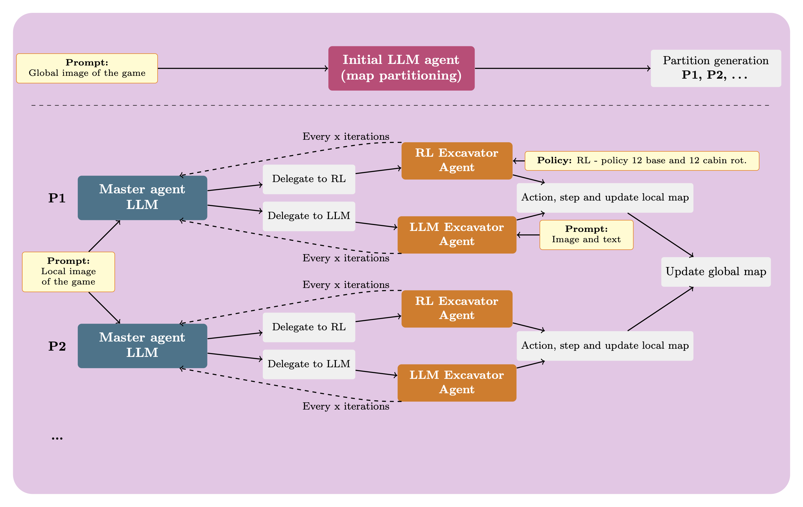

# Terra: Hybrid LLM and RL Approach

A sophisticated framework combining Large Language Models (LLMs) and Reinforcement Learning (RL) for intelligent map exploration and excavation tasks.

## 📋 Table of Contents

- [Overview](#overview)
- [Architecture](#architecture)
- [Installation](#installation)
- [Configuration](#configuration)
- [Usage](#usage)
  - [Basic Usage](#basic-usage)
  - [Running on Clusters](#running-on-clusters)
- [Supported Models](#supported-models)
- [Level Index Reference](#level-index-reference)
- [Prompts Documentation](#prompts-documentation)
- [Project Structure](#project-structure)
- [Contributing](#contributing)

## 🎯 Overview

This module implements a hybrid approach that leverages both LLMs and RL policies to efficiently process excavation tasks across partitioned maps. The system intelligently delegates between fast RL policies and more sophisticated LLM-based decision making based on the complexity of each partition.

## 🏗️ Architecture



The system operates in four main phases:

### 1. **Map Partitioning**
The map is divided into manageable sections using one of three methods:
- **Manual**: Direct specification of partition boundaries
- **Random**: Automated partitioning with configurable constraints
  - Minimum width/height (percentage-based)
  - Minimum target count per partition
- **LLM-based**: Intelligent partitioning using language models

### 2. **Partition Processing**
Each partition is managed by a master LLM agent that decides between:
- **RL Policy** (`delegate_to_RL`): Fast, pre-trained policy for routine tasks
- **LLM Policy** (`delegate_to_LLM`): Sophisticated decision-making for complex scenarios

### 3. **Synchronization**
- Global map updates after partition completion
- Cross-partition information synchronization
- Periodic re-evaluation of delegation strategy

### 4. **Iteration**
- Process continues until map completion
- Automatic progression to next map with fresh partitioning

## 🚀 Installation

### Prerequisites

1. Ensure Terra and Terra baselines are installed
2. Install additional dependencies from `environment_llm.yaml`:
   ```bash
   conda env create -f environment_llm.yaml
   conda activate terra-llm
   ```

### API Keys Setup

Export the API keys for your chosen model providers:

```bash
# Google Models (Gemini)
export GOOGLE_API_KEY="your-api-key-here"

# OpenAI Models (GPT, o3)
export OPENAI_API_KEY="your-api-key-here"

# Anthropic Models (Claude)
export ANTHROPIC_API_KEY="your-api-key-here"
```

## ⚙️ Configuration

The main configuration file is [`config_llm.yaml`](config_llm.yaml). Key parameters include:

- Partitioning strategy and constraints
- Model selection and API settings
- RL policy paths
- Iteration and synchronization intervals
- Logging and debugging options

Prompts can be customized by modifying files in the [`prompts`](prompts) folder.

## 📖 Usage

### Basic Usage

Run the main script with the following command:

```bash
DATASET_PATH=<path> DATASET_SIZE=<size> python -m llm.main_llm \
    --model_name <model> \
    --model_key <key> \
    --num_timesteps <steps> \
    -s <seed> \
    -n <num_env> \
    -run <policy_path> \
    --level_index <index>
```

#### Parameters

| Parameter | Description |
|-----------|-------------|
| `DATASET_PATH` | Path to the Terra-generated map dataset |
| `DATASET_SIZE` | Number of maps in the dataset |
| `--model_name` | LLM model identifier (see [Supported Models](#supported-models)) |
| `--model_key` | Provider key: `gpt`, `gemini`, or `claude` |
| `--num_timesteps` | Maximum steps per episode |
| `-s` | Random seed for reproducibility |
| `-n` | Number of parallel environments |
| `-run` | Path to pre-trained RL policy |
| `--level_index` | Map difficulty level (see [Level Index](#level-index-reference)) |

### Running on Clusters

For SLURM-based clusters (e.g., ETH Zürich Euler):

```bash
sbatch run_levels.slurm
```

Ensure API keys are properly configured in your cluster environment. Consult your cluster's [documentation](https://scicomp.ethz.ch/wiki/Main_Page) for specific setup instructions.

## 🤖 Supported Models

The framework supports multiple LLM providers through [LiteLLM](https://docs.litellm.ai/docs/):

### OpenAI
- `gpt-4o`
- `gpt-4.1`
- `o4-mini`
- `o3`
- `o3-mini`

### Google
- `gemini-1.5-flash-latest`
- `gemini-2.0-flash`
- `gemini-2.5-pro`
- `gemini-2.5-flash`

### Anthropic
- `claude-3-haiku-20240307`
- `claude-3-7-sonnet-20250219`
- `claude-opus-4-20250514`
- `claude-sonnet-4-20250514`

For the latest supported models, refer to the [LiteLLM providers documentation](https://docs.litellm.ai/docs/providers).

## 📊 Level Index Reference

| Level Name | Index | Description |
|------------|-------|-------------|
| All levels | None | Run all available levels |
| Foundations | 0 | Basic excavation tasks |
| Single Trenches | 1 | Simple linear excavations |
| Double Trenches | 2 | Parallel excavation paths |
| Double Diagonal | 3 | Angled parallel paths |
| Triple Trenches | 4 | Complex parallel structures |
| Triple Diagonal | 5 | Advanced angled patterns |

## 📝 Prompts Documentation

The system uses three types of specialized prompts:

### 1. **Partitioning Agent**
- [`partitioning.txt`](prompts/partitioning.txt): Standard adaptive partitioning
- [`partitioning_exact.txt`](prompts/partitioning_exact.txt): Fixed excavator count (experimental)

### 2. **Delegation Agent**
- [`delegation_no_intervention.txt`](prompts/delegation_no_intervention.txt): Production-ready autonomous delegation
- [`delegation.txt`](prompts/delegation.txt): Experimental intervention mode (not fully tested)

### 3. **Excavator Agent**
- [`excavator_llm_simple.txt`](prompts/excavator_llm_simple.txt): System prompt for LLM excavator control
- [`excavator_action.txt`](prompts/excavator_action.txt): Context-aware status updates

## 📁 Project Structure

```
llm/
├── assets/                      # Media and documentation assets
├── prompts/                     # Customizable prompt templates
│   ├── delegation_no_intervention.txt
│   ├── delegation.txt
│   ├── excavator_action.txt
│   ├── excavator_llm_simple.txt
│   ├── partitioning_exact.txt
│   └── partitioning.txt
├── __init__.py
├── config_llm.yaml             # Main configuration file
├── env_llm.py                  # Individual environment management
├── env_manager_llm.py          # Global environment orchestration
├── eval_llm.py                 # Benchmarking utilities
├── main_llm.py                 # Entry point
├── prompt_manager_llm.py       # Prompt loading and management
├── session_manager_llm.py      # LLM agent lifecycle management
└── utils_llm.py                # Helper functions and utilities
```

## 🤝 Contributing

Found a bug or have a feature request? Please open an issue and tag @gioelemo. We welcome contributions that improve the framework's capabilities or documentation.

### Development Guidelines

1. Follow existing code style and conventions
2. Add tests for new functionality
3. Update documentation as needed
4. Submit pull requests with clear descriptions

---

**Note**: This is an active research project. Performance may vary based on model selection and task complexity.